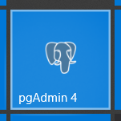
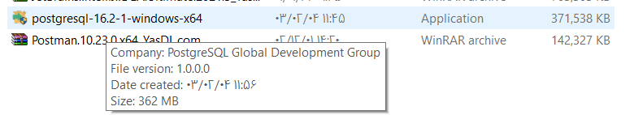
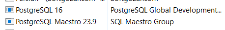
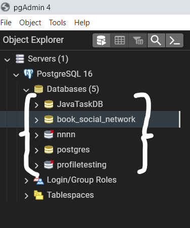
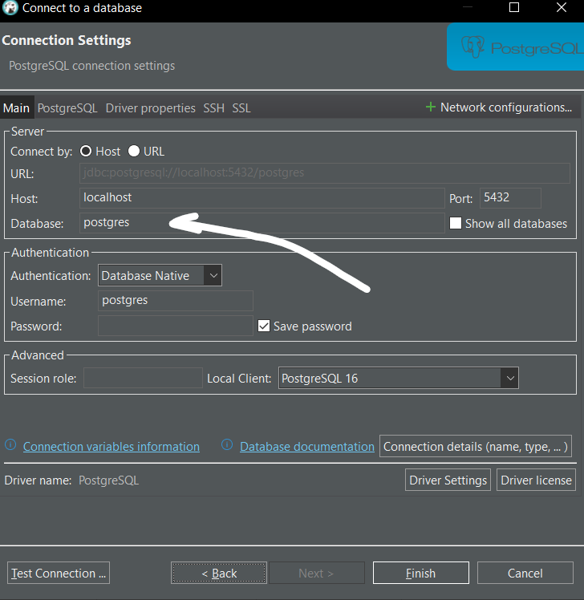

# data base hint
*************
### **Postgres Connection**
for connecting to postgres connection:

download postgres server :           

       

the database name is the name you see in database          

    spring:
        datasource:
            url: jdbc:mysql://localhost:3306/university  #(database or schema name ,not server name)
            username: root # (the user name of ,mysql server ,not database or schema)
            password:      # (the password of ,mysql server ,not database or schema)
        driver-class-name: com.mysql.cj.jdbc.Driver
    jpa:
        hibernate:
            ddl-auto: update  
        show-sql: true    # it show sql statements that execute
    # This will create table automatically in your database

or in advanced level:

    # (the name ot database,not server the item that you see in database folder in pgadmin4)
    spring:
        datasource:
            driver-class-name: org.postgresql.Driver
            url: jdbc:postgresql://localhost:5432/       #(the name of database)
        username: postgres # (the username that default is "postgres")
        password: postgres # (the password that i set is "postgres")
    jpa:
        hibernate:
            ddl-auto: update
        # by defulat this is false
        how-sql: true    # when run or hibernate execute command or query  it will be displayed in your ide or in the logs of your application
        properties:
            hibernate:
            format_sql: true
        database: postgresql
        database-platform: org.hibernate.dialect.PostgreSQLDialect

if you one the simple one use this:

    # (the name ot database,not server the item that you see in database folder in pgadmin4)
    spring:
        datasource:
            driver-class-name: org.postgresql.Driver
            url: jdbc:postgresql://localhost:5432/ # (the name ot database)
            username: postgres # (the username that default is "postgres")
            password: postgres # (the password that i set is "postgres")
    jpa:
        hibernate:
            ddl-auto: update    # for developing use create or ubdate
                                # "create drop" create the schama after finishing delete them
                                # "validate" validate schema make but make no change

you can check this gihub repository for copy and pasting better:              
[https://github.com/ali-bouali/book-social-network/blob/main/book-network/src/main/resources/application-dev.yml](book-social-network/blob/main/book-network/src/main/resources/application-dev.yml)
[https://github.com/ali-bouali/spring-boot-bootcamp/blob/main/src/main/resources/application.yml](spring-boot-bootcamp/blob/main/src/main/resources/application.yml)

concreting in dbeaver:       
              
the data base name will come here the name that we see in `database` folder in pgadmin4
and the exact same name in `url: ... ` in yml file

*********************
VERY IMPORTANT

first you need to install mysql server and you can install that from above link and the tutorial of that in this link too
https://www.w3-farsi.com/posts/18452/install-mysql-server/

then you should install MYSQL Administrator :
https://www.w3-farsi.com/posts/18452/install-mysql-server/

and after that you make sure you have that install base on upper link you can use mysql command prompt (i do not actually know that you can to this by normal command prompt or not)