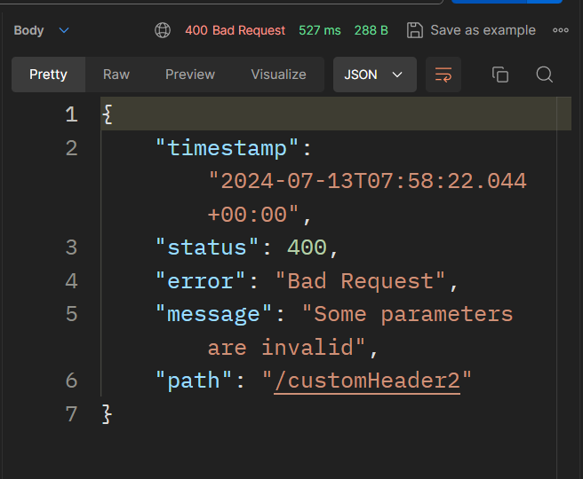
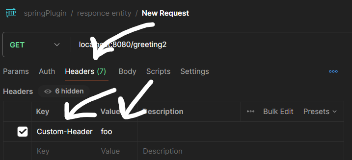
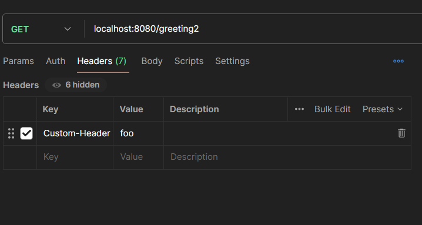
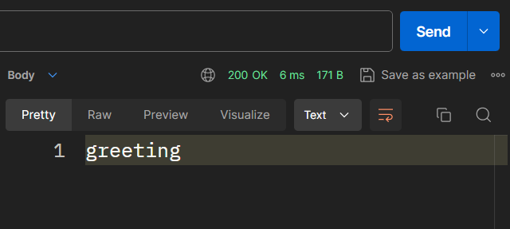
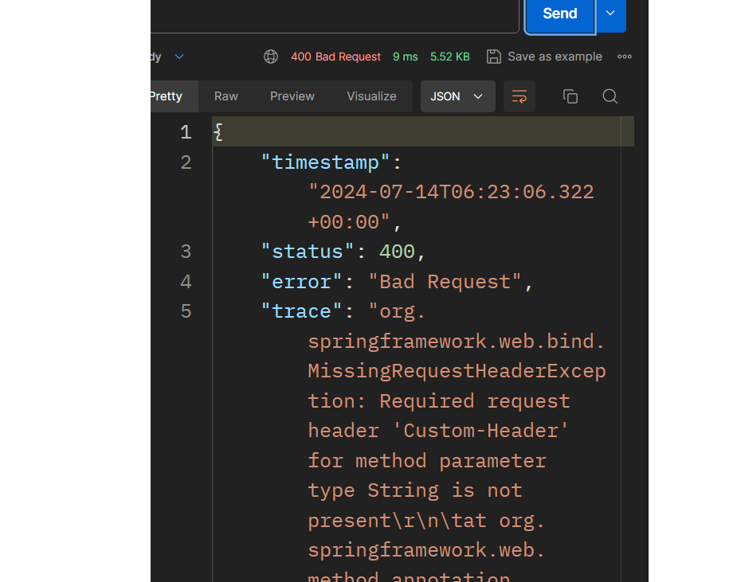

response-entity:       

[spring response entity](https://www.baeldung.com/spring-response-entity)

http verb:          
[HTTP Methods OPTIONS](https://developer.mozilla.org/en-US/docs/Web/HTTP/Methods/OPTIONS)

[https://www.baeldung.com/rest-assured-response](https://www.baeldung.com/rest-assured-response)

[https://www.baeldung.com/spring-response-status](https://www.baeldung.com/spring-response-status)

http status code: 
if the method called we can get this status 

    @ResponseStatus(HttpStatus.NOT_ACCEPTABLE)

like:
    
    @GetMapping("/d/d")
    @ResponseStatus(HttpStatus.)
    public String getMapping(){
        return "getMapping is called";
    }
When we want to signal an error, we can provide an error message via the reason argument:

    @GetMapping("/customHeader2")
    @ResponseStatus(value = HttpStatus.BAD_REQUEST, reason = "Some parameters are invalid")
    ResponseEntity<String> customHeader2() {
        return ResponseEntity.ok()
                .header("Custom-Header", "foo")
                .body("Custom header set"); // it should be the last call.

        // Since BodyBuilder.body() returns a ResponseEntity instead of BodyBuilder, it should be the last call.
        // Note that with HeaderBuilder we can’t set any properties of the response body.
    }

[HTTP status code](https://developer.mozilla.org/en-US/docs/Web/HTTP/Methods/OPTIONS)

******
# Headers

An HTTP header is a field of an HTTP request or response that passes additional context and metadata about the request or response. 
For example, a request message can use headers to indicate it's preferred media formats, 
while a response can use header to indicate the media format of the returned body
for passing header come here
[HTTP_header](https://developer.mozilla.org/en-US/docs/Glossary/HTTP_header)

in code you maybe see this    

    .header("Custom-Header", "foo")headerName , headerValue

   

if you pass wrong header value but correct header name it will send 200 

Then we can access the value using the variable passed into our method. 
If a header named accept-language isn’t found in the request, the method returns a “400 Bad Request” error.

      
                            

    @GetMapping("/greeting2")
    public ResponseEntity<String> greeting(@RequestHeader(name = "Custom") String language2) {
        /*
         just one parameter can have @RequestHeader
         the second one and the third one will not be considered
         the header value of the header name that match to the header name will save in the 
         annotated parameter
         code that uses the language variable
        */
        return new ResponseEntity<String>("greeting", HttpStatus.OK);
    }

just one parameter can have @RequestHeader
the second one and the third one will not be considered

[spring-rest-http-headers ](https://www.baeldung.com/spring-rest-http-headers)  

[https://docs.spring.io/spring-framework/docs/5.1.2.RELEASE_to_5.1.3.RELEASE/Spring%20Framework%205.1.3.RELEASE/org/springframework/http/HttpRequest.html](https://docs.spring.io/spring-framework/docs/5.1.2.RELEASE_to_5.1.3.RELEASE/Spring%20Framework%205.1.3.RELEASE/org/springframework/http/HttpRequest.html)

******************
he Spring Framework provides the following choices for making calls to REST endpoints:

**RestClient** - synchronous client with a fluent API.

**WebClient** - non-blocking, reactive client with fluent API.

**RestTemplate** - synchronous client with template method API.

**HTTP Interface** - annotated interface with generated, dynamic proxy implementation.

[https://docs.spring.io/spring-framework/reference/integration/rest-clients.html](https://docs.spring.io/spring-framework/reference/integration/rest-clients.html)

### **RestClient**

[https://github.com/danvega/spring-clients](https://github.com/danvega/spring-clients)
[https://www.baeldung.com/spring-boot-restclient](https://www.baeldung.com/spring-boot-restclient)

