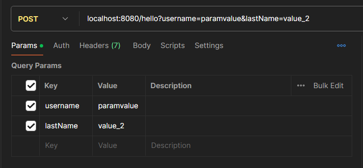
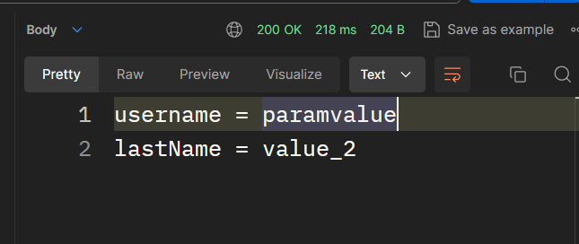
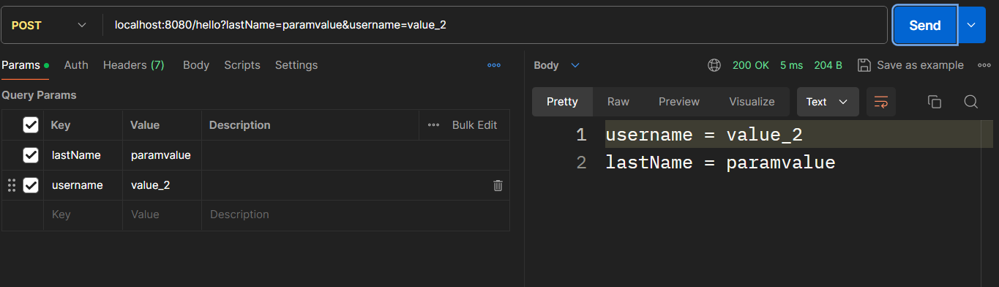

for renaming field in postman or json body use **`@JsonProperty`**
    
    @JsonProperty("(name that you want to use just in postman or ...)")

like:
    
    @JsonProperty("c-name")
    private String customerName;

**do not have any typos** 

******************
## @RequestBody

for getting request body :
go to postman
search your specific endpoint 
select the body 
select raw 
select the JSON

and have this format in the text field:      

    {
        "the exact filed name" :  ,
        "the exact filed name" :  ,
        "the exact filed name" : 
    }

like:

    {
    "customerName" :  "ff",   // if string sent in "" 
    "productName" :  "f",     // if string sent in "" 
    "numberOfProduct" : 1     // if integer sent in integer
    }

for changing field name just for use in controller not in java project :

use: **`@JsonProperty("(name that you want to use just in postman or ...)")`**      
 
like:

    @JsonProperty("c-name")
    private String customerName;

for calling in postman use `c-name` 
for calling in java project use `customerName`

****************
## **@PathVariable**                        

if you want to get data from the url like:          

    localhost:8080/d/d/ehsan

use @PathVariable like:             

**use the exact same name with the parameter:

    @PostMapping("/d/d/{message}")
    public String postMapping(@PathVariable String message){
        return "you sent " + message2;
    }

or if you have not same name,set name for that           

    @PostMapping("/d/d/{message}")
    public String postMapping(@PathVariable("message") String messageFromBackEnd){
        return "you sent " + messageFromBackEnd;
    }

***************
## **@RequestParam**    
if you want tget data from the table in param in postman or like this in url:
    
    localhost:8080/hello?user-name=paramvalue&user-lastname=value_2

use **@RequestParam** 
    
    public String postTransactionPram(
            @RequestParam("username") String userName,
            @RequestParam("lastName") String userLastName
            ){
        return "username = " + userName + "\nlastName = " + userLastName;
    }

and paste them in :           

and you call the key and get the value from it (not the value in it)

the order in java method in not essential :

    public String postTransactionPram(
            @RequestParam("lastName") String userLastName,
            @RequestParam("username") String userName
        ){
        return "username = " + userName + "\nlastName = " + userLastName;
    }
or in  postman:

